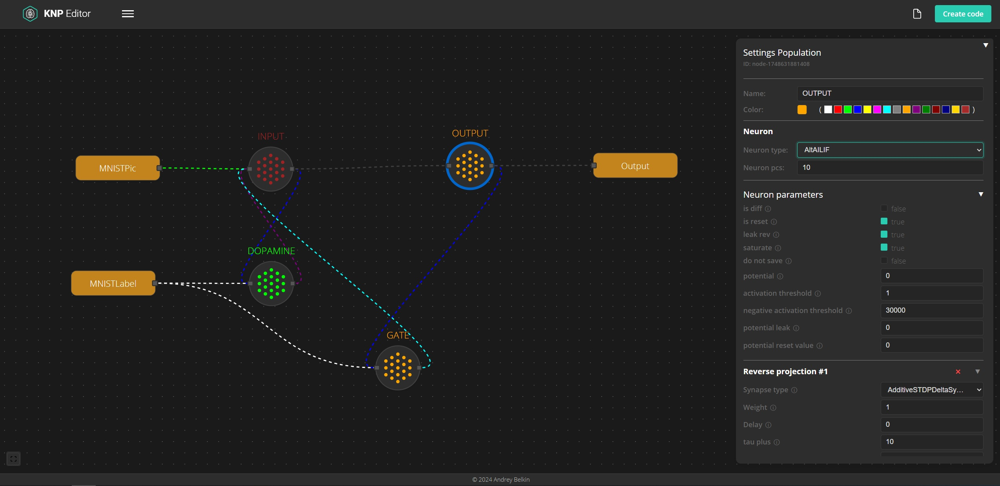

# KNP Editor

Network configuration editor for https://github.com/KasperskyLab/knp



## Requirements

- Node.js (version 18 or higher)
- npm (version 9 or higher)

## Project Structure

The project consists of two main parts:
- `client/` - client-side (React + Vite)
- `server/` - server-side (Node.js + Express)

## Installation and Running

### 1. Clone the Repository

```bash
git clone <repository-url>
cd kaspersky-editor
```

### 2. Install Dependencies

#### Client-side
```bash
cd client
npm install
```

#### Server-side
```bash
cd server
npm install
```

### 3. Run the Application

#### Start the Server
```bash
cd server
npm start 
    or 
npm run dev
```
The server will start on port 3000 (http://localhost:3000)

#### Start the Client
```bash
cd client
npm run dev
```
The client application will be available at http://localhost:5173

## Development

### Client-side
- Uses React with Vite for fast development
- ESLint is configured for code quality maintenance
- Main code is located in the `client/src` directory

### Server-side
- Built on Node.js using Express
- Main server file: `server/index.js`

## Scripts

### Client-side
- `npm run dev` - start development server
- `npm run build` - build the project
- `npm run lint` - run code linter

### Server-side
- `npm start` - start the server
- `npm run dev` - start the server in development mode with auto-reload

## Notes

- Make sure ports 3000 (server) and 5173 (client) are available before starting
- Both parts (client and server) must be running for the application to work correctly
- In development mode, the client automatically reloads when code changes 